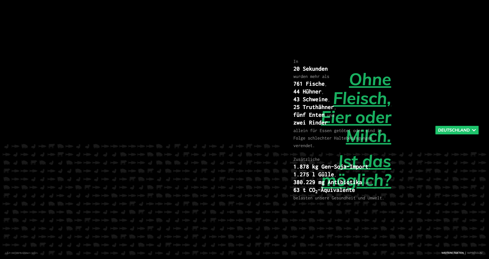

# Deine Entscheidung Zählt

[](https://app.buddy.works/joterr/deine-entscheidung-zaehlt/pipelines/pipeline/201258)

Information page on the effects of livestock farming in Germany. www.deine-entscheidung-zaehlt.de



## Author
Jannik Rulitschka, hallo@jannikrulitschka.de

## Licence
This project is licensed under GNU General Public License v3.0 (GNU GPLv3).

## Project setup
```
npm install
```

### Compiles and hot-reloads for development
```
npm run serve
```

### Compiles and minifies for production
```
npm run build
```

### Run your tests
```
npm run test
```

### Lints and fixes files
```
npm run lint
```
